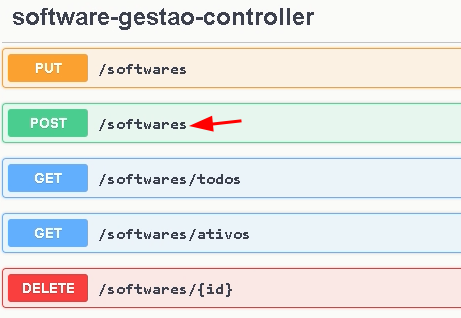
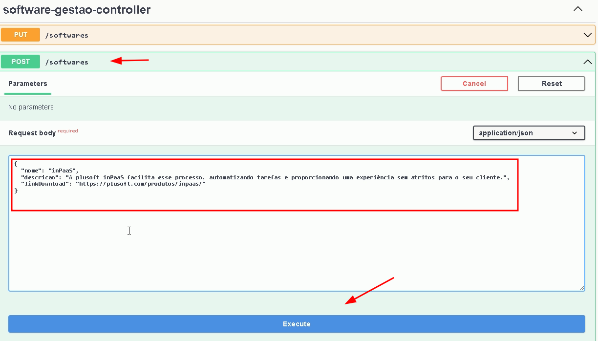
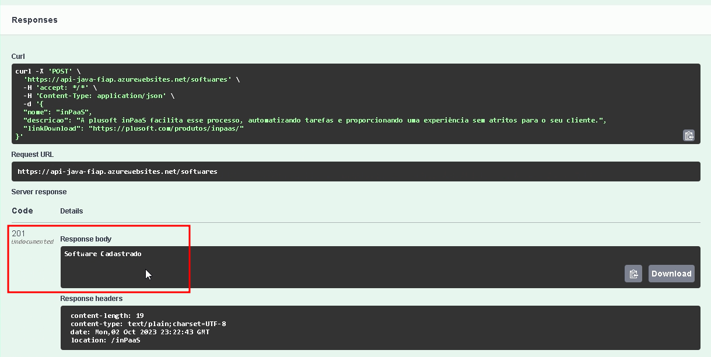
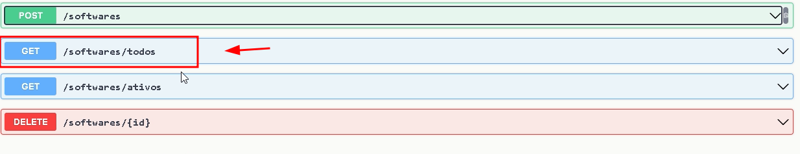
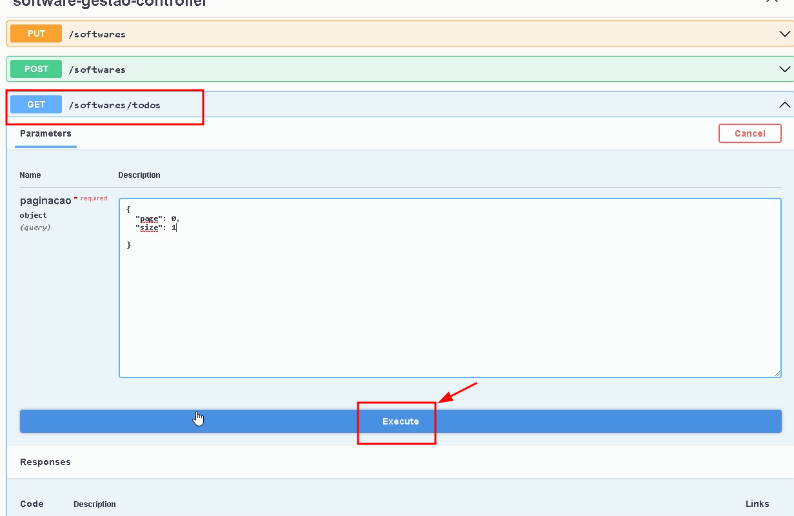
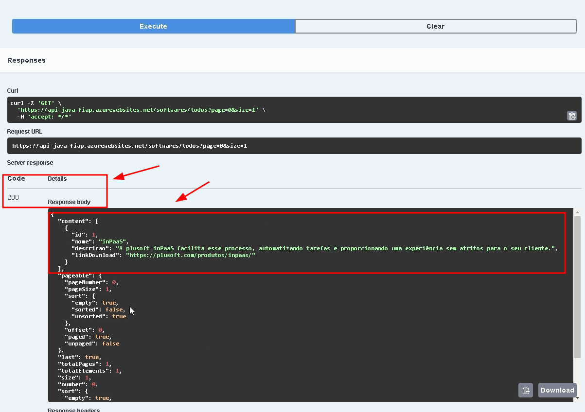

# Api em Java SpringBoot Deploy no Azure

**Passo a passo para fazer deploy de uma aplicação Spring Boot no Azure, como um web app, com o código fonte da aplicação no GitHub:**

**Pré-requisitos:**

* Conta da Microsoft Azure
* Grupo de recursos no Azure
* Plano de serviço do Azure
* Servidor SQL Server no Azure
* Banco de dados SQL Server no Azure
* Código-fonte da aplicação Spring Boot no GitHub

**Passo 1: Criar a infraestrutura do banco de dados no Azure**

1. Abra o terminal e execute o seguinte comando para criar um grupo de recursos:

```
az group create --name gruporecursos --location brazilsouth
```

2. Execute os seguintes comandos para criar um servidor SQL Server, um banco de dados SQL Server e uma regra de firewall:

```
az sql server create -l brazilsouth -g gruporecursos -n sqlserver-app -u admsql -p dbacesspasswd@123 --enable-public-network true
```

```
az sql db create --resource-group gruporecursos --server sqlserver-app --name dbapp --service-objective basic --backup-storage-redundancy local --zone-redundant false
```
- apenas para testes! esse regra permite acesso indefinido 

```
az sql server firewall-rule create --resource-group gruporecursos --server sqlserver-app --name allowall --start-ip-address 0.0.0.0 --end-ip-address 255.255.255.255 
```


**Passo 2: Importar o projeto Spring Boot do GitHub**

1. Abra o Eclipse.
2. No menu **Window** > **Show View** > **Other**, selecione **Git Repositories**.
3. No menu **File** > **Import**, selecione **Projects from Git**.
4. Na janela **Import Projects from Git**, selecione **Clone URI**.
5. Na janela **Clone Git Repository**, informe a URL do repositório do GitHub do seu projeto Spring Boot.
6. Clique em **Next**.
7. Na janela **Select Repository Location**, selecione o local onde você deseja salvar o projeto.
8. Clique em **Next**.
9. Na janela **Select Branches**, selecione a branch que você deseja importar.
10. Clique em **Finish**.

**Passo 3: Configurar a conexão com o banco de dados**

1. Abra o arquivo `application.properties` do seu projeto Spring Boot.
2. Altere as propriedades `spring.datasource.url` e `spring.datasource.username` para o endereço do seu servidor SQL Server, o nome de usuário e a senha do banco de dados.

**Passo 4: Criar um serviço de aplicativo no Azure**

1. Acesse o portal da Azure.
2. No menu **Web Apps**, clique em **Create**.
3. Na página **Create Web App**, insira as seguintes informações:
    * **Nome do aplicativo:** O nome do seu aplicativo Web no Azure.
    * **Região:** A região do Azure onde você deseja implantar o aplicativo Web.
    * **Plano de serviço:** O plano de serviço do Azure que você deseja usar para o aplicativo Web.
    * **Tipo de aplicativo:** **Java**.
    * **Tipo de implantação:** **Automático**.
4. Clique em **Create**.

**Passo 5: Implantar o aplicativo no Azure**

1. No Eclipse, clique com o botão direito do mouse no projeto Spring Boot e selecione **Azure** > **Publish as Azure Web App

2. **Documentação para implantação de uma aplicação Spring Boot no Azure usando GitHub Actions**

**Pré-requisitos**

* Conta da Microsoft Azure
* Grupo de recursos no Azure
* Plano de serviço do Azure
* Serviço de aplicativo no Azure
* Código-fonte da aplicação Spring Boot no GitHub
* GitHub Actions configurado no repositório do GitHub

**Passo 1: Criar o serviço de aplicativo no Azure**

1. Acesse o portal da Azure.
2. No menu **Web Apps**, clique em **Create**.
3. Na página **Create Web App**, insira as seguintes informações:
    * **Nome:** api-spring-boot-xx
    * **Região:** Brasil South
    * **Plano de serviço:** F1
    * **Tipo de aplicativo:** Java
    * **Tipo de implantação:** Automático

4. Na aba **Implementação**, selecione a opção **GitHub Actions** e clique em **Criar**.
5. Na aba **GitHub Actions**, insira as seguintes informações:
    * **Repositorio:** A URL do repositório do GitHub do seu projeto Spring Boot.
    * **Branch:** A branch que você deseja implantar.
6. Clique em **Salvar**.

**Passo 2: Implantar o aplicativo no Azure**

1. No repositório do GitHub, faça um commit e push das alterações no código-fonte da aplicação.
2. No portal da Azure, aguarde a conclusão da implantação.

**Passo 3: Testar o aplicativo**

1. Abra o navegador e acesse o URL do seu aplicativo Web.
2. Para testar a API, use uma ferramenta como o Postman ou o cURL.

**Testando a API com o Swagger:**

1. Insira a URL do web app com o sufixo `/swagger-ui/index.html#/` para ter acesso a todos os endpoints da aplicação.
2. Ira listar todos os endpoints em nossa aplicação.
3. abaixo algumas fotos realizando um solicitação HTTP do tipo **POST** & **GET**.








- Um exemplo de json para controler de usuário

- **POST** /usuarios/login:
```
{
  "nome": "Leonardo Figueiras",
  "email": "leo.figueiras@shareasale.com",
  "senha": "lZ4'T*c2ny>1a#J!n~j\\"
}
```

- **POST** /usuarios/cadastrar:
```
{
  "nome": "Leonardo Figueiras",
  "email": "leo.figueiras@shareasale.com",
  "senha": "lZ4'T*c2ny>1a#J!n~j\\"
}
```

- **PUT** /usuarios/:
```
{
  "id": 0,
  "nome": "string",
  "sobrenome": "string"
}

```

- **GET** /usuarios/todos (sem body!)

- **DELETE**/usuarios/{id} (sem body!)


**Observações:**

* **Somente é possível habilitar o GitHub Actions na criação do Web App com o SO Windows. Para Linux, deverá ser efetuado depois da criação do Recurso (Web App) através do Centro de Implantação.**
* **Na aba Implantação, deixe o opção de Habilitar a Implantação Contínua e autorize o acesso do Azure em sua conta no GitHub.**
* **Na aba Implantação, informe sua conta no GitHub, qual o Repositório e Branch para o Build e Deploy.**
* **Ainda na aba Implantação, analise o arquivo YML gerado.**
* **Na aba Rede, deixe o Acesso Público Ativado.**
* **Na aba Monitoramento, deixe o Application Insights desabilitado para esse projeto.**
